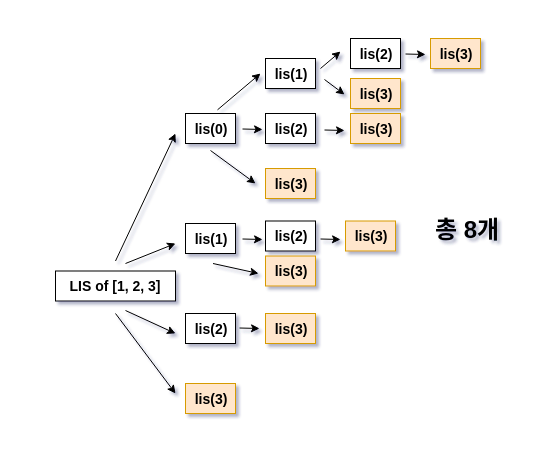

## 가장 긴 증가하는 부분 수열

#### 임의의 수열이 주어질 때, 수열에서 몇 개의 수를 제거하여 부분 수열을 만들 수 있다. 이때, 가장 긴 수열을 구하면 되는 문제

* 참고 링크 : https://shoark7.github.io/programming/algorithm/3-LIS-algorithms

* 개념
    1. 어떤 수열에서 특정 부분을 지워서 만들어낼 수 있는 증가 부분수열(increasing subsequence) 중 가장 긴 수열
    2. 부분 수열의 숫자들은 원 배열에서 위치가 이어져 있지 않아도 된다는 주요한 특징
    
* sample 
  
  원 배열이 [1, 4, 6, 8, 3, 5, 6, 7]일 때 [1,6,8], [4,6,8] 은 증가 부분수열인데, 이 중 가장 긴 부분열은 
  [1,3,5,6,7]이 된다. 이때 중간의 [4,6,8] 등은 생략한 것을 알 수 있다.

* 문제의 풀이 방법
1. Brute Force (완전 탐색)
2. Dynamic Programming (동적 계획법)
3. Binary Search (이분 탐색)

#### Brute Force
    * 심플하게 숫자 앞에서부터 하나씩 비교해 나간다.
    * 시간 복잡도 = O(2의 n승)

lis(i) := i번째 원소부터 끝까지의 최장 증가수열의 길이

~~~python
arr = [1, 4, 6, 8, 3, 5, 6, 7]

def lis(arr):
    if not arr:
        return 0

    ret = 1
    for i in range(len(arr)):
        nxt = []
        for j in range(i + 1, len(arr)):
            if arr[i] < arr[j]:
                nxt.append(arr[j])
        ret = max(ret, 1 + lis(nxt))
    return ret

print(lis(arr))
# 5
~~~

#### Dynamic Programming
    * 상기 수형도에서 보듯이, 반복호출이 많다 -> 캐싱으로 중복 제거를 하자!!
    * 시간 복잡도 = O(n의 제곱)

~~~python
import math

arr = [1, 4, 6, 8, 3, 5, 6, 7]

def lis(arr):
    arr = [-math.inf] + arr
    N = len(arr)
    cache = [-1] * N
    
    #염두할 것은 Sequence arr 의 0 번째 인덱스에 음의 무한을 넣었다는 것. 
    # 이것은 [100, 1, 2, 3]과 같이 원 Sequence의 첫 번째 값이 가장 큰 값일 때를 대비하기 위한 것. 

    def find(start):
        if cache[start] != -1:
            return cache[start]

        ret = 0
        for nxt in range(start+1, N):
            if arr[start] < arr[nxt]:
                ret = max(ret, find(nxt) + 1)

        cache[start] = ret
        return ret

    return find(0)

print(lis(arr))
~~~

#### Binary Search
    * 상기 수형도에서 보듯이, 반복호출이 많다 -> 캐싱으로 중복 제거를 하자!!
    * 시간 복잡도 = O(n의 제곱)

