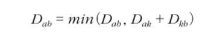

## 최단 경로

#### 가장 빠른 길 찾기
    * 한 지점에서 다른 특정 지점까지의 최단 경로를 구하기
    * 모든 지점에서 다른 모든 지점까지의 최단 경로를 모두 구해야하는 경우
    * 그리디/다이나믹 프로그래밍이 그대로 적용된다!

#### 종류
    1. 다익스트라 최단 경로 알고리즘
    2. 플로이드 워셜
    3. 벨만 포드 알고리즘

#### 다익스트라 알고리즘 (Dijkstra)

* 그래프에서 여러 개의 노드가 있을 때, 특정한 노드에서 출발하여 다른 노드로 가는 각각의 최단 경로를 구해주는 알고리즘
* GPS 소프트웨어의 기본 알고리즘

#### 다익스트라 알고리즘 원리
    1. 출발 노드를 설정
    2. 최단 거리 테이블을 초기화
    3. 방문하지 않은 노드 중에서 최단 거리가 가장 짧은 노드를 선택
    4. 해당 노드를 거쳐 다른 노드로 가는 비용을 계싼하여 최단 거리 테이블을 갱신
    5. 위 과정에서 3과 4번을 반복한다

#### 구현 방법
    1. 구현하기 쉽지만 느리게 동작하는 코드
    2. 구현하기에 조금 더 까다롭지만 빠르게 동작하는 코드

#### 핵심
* 방문하지 않은 노드 중에서 가장 최단 거리가 짧은 노드를 선택
    = `한 단계당 하나의 노드에 대한 최단 거리를 확실히 찾는 것`
  
1. 간단한 다익스트라 알고리즘
    * 시간복잡도 = O(V제곱) (V는 노드의 개수, E는 간선의 개수)
    * 단계마다 방문하지 않은 노드 중에서 최단 거리가 가장 짧은 노드를 선택하기 위해, 매 단계마다 1차원 리스트의 모든 원소를 확인(순차탐색) 한다
    * 전체 노드의 개수가 5000개 내이면 대부분 통과 가능하나, 10000개 넘어가는 경우 개선된 다익스트라 알고리즘을 사용해야한다!!    
    * [dijkstra_easy_way](../Shortest_Path/dijkstra_easy_way.py)
   
 

2. 개선된 다익스트라 알고리즘
    * 시간 복잡도 = O(ElogV) (V는 노드의 개수, E는 간선의 개수)
    * 최단 거리가 짧은 노드를 선형적인 방법이 아닌 `힙 자료구조` 를 이용하여 시간을 줄인다!! 
    * 힙 자료구조는 [heap.md](../../../my_note/knowledge/library/heap/heap.md) 참고
    * [dijkstra_heapq](../Shortest_Path/dijkstra_heapq.py)
   
| 자료구조 | 추출되는 데이터 | 
| --- | --- | 
| Stack | 가장 나중에 삽입된 데이터 | 
| Queue | 가장 먼저 삽입된 데이터  | 
| Priority Queue | 가장 우선순위가 높은 데이터  | 

#### 플로이드 워셜 알고리즘 (Floyd-Warshall Algorithm)

* 모든 지점에서 다른 모든 지점까지의 최단 경로를 모두 구해야 하는 경우

#### 다익스트라 알고리즘과 다른점
1. 다익스트라 알고리즘
   * 단계마다 최단 거리를 가지는 노드를 하나씩 반복적으로 선택
   * 그리고 해당 노드를 거쳐 가는 경로를 확인하며, 최단 거리 테이블을 갱신하는 방식으로 동작
   * 1차원 리스트를 이용
   * 그리디 알고리즘
   
2. 플로이드 워셜
   * 단계마다 `거쳐 가는 노드`를 기준으로 알고리즘을 수행
   * `하지만 배번 방문하지 않는 노드 중에서 최단 거리를 갖는 노드를 찾을 필요가 없다!`
   * 노드의 개수가 N개일 때 알고리즘상으로 N번의 단계를 수행하며, 단계마다 O(N의제곱)의 연산을 통해 `현재 노드를 거쳐 가는` 모든 경로를 고려
   * 시간 복잡도는 O(N의 세제곱) 이다
   * 2차원 리스트를 이용
   * 다이나믹 프로그래밍 (N번 만큼의 단계를 반복하며 점화식에 맞게 2차원 리스트를 갱신)

#### 플로이드 워셜 접근법
* 현재 확인하고 있는 노드를 제외하고, N-1개의 노드 중에서 서로 다른 노드 (A,B) 쌍을 선택
* 이후에 A -> 1번 노드 ->B 로 가는 비용을 확인 이후, 최단 거리를 갱신
* n-1P2 개의 쌍을 단계마다 반복해서 확인

