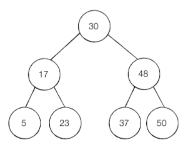

### 이진 탐색

1. 순차 탐색 (Sequential Search)

    * 리스트 안에 있는 특정한 데이터틑 찾기 위해 앞에서부터 데이터를 하나씩 차례대로 확인하는 방법
    * 정렬되지 않는 리스트에서 데이터를 찾아야 할 때 사용
    * 데이터가 아무리 많아도 시간만 충분하다면 항상 원하는 데이터를 찾을 수 있다
    * 리스트 자료형에서 특정한 값을 가지는 원소를 새는 count() 메서드도 순차 탐색으로 수행됨.
    * 순차 탐색의 시간 복잡도 : 최악의 경우 O(N)
    
~~~python
# 순차 탐색
def sequential_search(n, target, array):
    for i in range(n):
        if array[i] == target:
            return i + 1    # 현재 위치 반환 (인덱스는 0부터 시작하므로)

print("생성할 원소의 개수 와 한 칸 띄고 찾을 문자열을 입력하세요")
input_data = input().split()
n = int(input_data[0])
target = input_data[1]

print("앞서 적은 원소 개수만큼 문자열을 입력해주세요")
array = input().split()

print(sequential_search(n,target,array))

# 입력
# 5 Dongbin
# Hanul Jonggu Dongbin Taeil Sangwook

# 출력
# 3
~~~

2. 이진 탐색 (Binary Search) : 반으로 쪼개면서 탐색하기
    * `배열 내부의 데이터가 정렬되어 있어야만 사용`할 수 있다.
    * 정렬되어 있다면 매우 빠르게 찾을 수 있음
    * 위치를 나타내는 `시작점, 끝점, 중간점` 을 사용
    * 찾으려는 데이터와 중간점(Middle) 위치에 있는 데이터를 반복적으로 비교
    * 이진 탐색은 `한 번 확인할 때마다 확인하는 원소의 개수가 절반씩 줄어든다`. = 시간복잡도 O(logN)
    * 이진 탐색은 2-1. 재귀함수를 이용 2-2. 단순 for문 이용 하는 방식이 있다.
    
2-1. 재귀를 이용한 이진 탐색
~~~python
# 재귀 함수 이용
def binary_search(array, target, start, end):
    if start > end:
        return None
    mid = (start + end) // 2
    
    # 찾은 경우 중간점 인덱스 반환
    if array[mid] == target:
        return mid
    elif array[mid] > target:
        # 중간값보다 target이 작은경우 왼쪽 데이터를 확인
        return binary_search(array, target, start, mid - 1)
    else:
        return binary_search(array, target, mid + 1, end)

# 원소의 개수 / target
n, target = list(map(int, input().split()))

# 전체 원소
array = list(map(int, input().split()))

result = binary_search(array, target, 0, n-1)
if result == None:
    print("원소가 읎다")
else:
    print(result + 1)

# 입력
# 10 7
# 1 3 5 7 9 11 13 15 17 19

# 출력
# 4
~~~

2-1. 반복문을 이용한 이진 탐색
~~~python
# for문 이용
def binary_search(array, target, start, end):
    while start <= end:
        mid = (start + end) // 2

        # 찾은 경우 중간점 인덱스 반환
        if array[mid] == target:
            return mid
        elif array[mid] > target:
            end = mid - 1
        else:
            start = mid + 1
    return None

# 원소의 개수 / target
n, target = list(map(int, input().split()))

# 전체 원소
array = list(map(int, input().split()))

result = binary_search(array, target, 0, n - 1)
if result == None:
    print("원소가 읎다")
else:
    print(result + 1)
~~~

* 코딩 데스트에서의 이진 탐색
    * 이진 탐색은 실제 구현이 까다롭다 (제대로 구현하는 사람이 10%내외라고한다)
    * `코딩 테스트에서 단골로 나오는 문제이니 가급적 외우길 권장`
    * 또한 이진 탐색의 원리는 다른 알고리즘에서도 폭넓게 적용되는 원리와 유사함
    * `탐색 범위가 큰 상황에서의 문제가 많다!! - 탐색 범위가 2000만 넘어가면 이진 탐색으로 접근해보자!!`
    * 처리해야 할 데이터의 개수나 값이 1000만 단위 이상으로 넘어가면 이진 탐색 고려해보기
    
* 트리 자료구조
    * 이진 탐색은 전제 조건이 `데이터 정렬` 이다
    * 데이터베이스는 내부적으로 대용량 데이터 처리에 적합한 `트리(Tree)` 자료구조를 이용하여 항상 데이터가 정렬되어 있다.
    * 데이터베이스에서의 탐색은 이진 탐색과 유사한 탐색을 하여 항상 빠르다
    * 트리의 특징
        1. 트리는 부모 노드와 자식 노드의 관계로 표현
        2. 트리의 최상단 노드 = 루트 노드
        3. 트리의 최하단 노드 = 단말 노드
        4. 트리에서 일부를 떼어내도 트리 구조이며, 이를 서브 트리라고 한다.
        5. 트리는 파일 시스템과 같이 계층적이고 정렬된 데이터를 다루기 적합하다.

* 이진 탐색 트리
    * 이진 탐색이 동작 할 수 있도록 고안된, 효율적인 탐색이 가능한 자료구조
        
    
    * 특징
        1. 부모 노드보다 왼쪽 자식 노드가 작다
        2. 부모 노드보다 오른쪽 자식 노드가 크다
    * 이진 탐색 트리에 데이터를 넣고 빼는 방법은 알고리즘보다 자료구조에 가까움 -> `출제 빈도 낮음` (책에도 없다)
    
* 이진 탐색에서 빠르게 입력 받기 (python)
    * 입력 데이터가 많거나, 탐색 범위가 넓다.
    * 이 경우 python 에서 input() 쓰면 동작 속도가 느리다
    * `sys 라이브러리에 readline 을 사용`하자!!
    * rstrip을 사용해야 엔터의 줄 바꿈 기호 문자를 제거한다.
    
~~~python
import sys

input_data = sys.stdin.readline().rstrip()

print(input_data)
~~~

    

    

