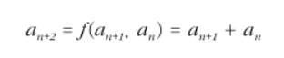
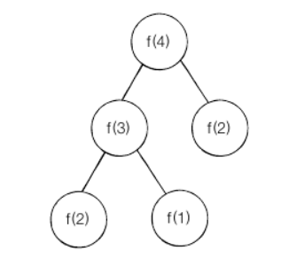
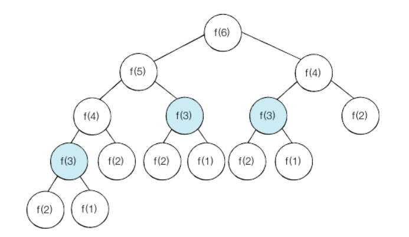
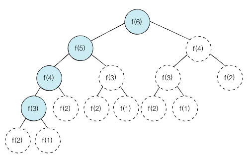

##다이나믹 프로그래밍 (동적 계획법)

### 중복되는 연산을 줄이자

* 연산 속도와 메모리 공간을 최대한 활용 할 수 있는 효율적인 알고리즘 작성 필요

### 다이나믹 프로그래밍의 대표적 예시

* 피보나치 수열
    * 정의 - 이전 두 항의 합을 현재의 항으로 설정하는 수열
    * 피보나치 수열의 점화식

      
    * n번째 피보나치 수 = (n-1)번쨰 피보나치 수 + (n-2)번쨰 피보나치 수
    * 단, 1번째 피보나치 수 = 1, 2번째 피보나치수 = 1
    * 실제 구하는 과정

      

    * 예시

~~~python
def fibo(x):
    if x == 1 or x == 2:
        return 1
    return fibo(x - 1) + fibo(x - 2)

print(fibo(4))  # 3
~~~

### 피보나치 수열 문제점

* 상기와 같은 형태로 구현 시 `f(n) 함수에 n이 커지면 커길수록 수행시간이 기하급수적으로 늘어남`  
* 2^n 만큼의 지수 시간이 걸림 (ex. n이 30인 경우 10억가량의 연산을 수행해야한다..)
      

* 위의 그래프와 같이 동일한 함수가 반복적으로 수행됨.

### 다이나믹 프로그래밍의 사용
* 사용 조건
    1. 큰 문제를 작은 문제로 나눌 수 있다
    2. 작은 문제에서 구한 정답은 그것을 포함하는 큰 문제에서도 동일하다
    
* 메모이제이션(Memoization) 기법
    * 다이나믹 프로그래밍을 구현하는 방법 중에 한 종류   
    * 한 번 구한 결과를 메모리 공간에 메모해두고 같은 식을 다시 호출하면 메모한 결과를 그대로 가져오는 기법
    * 값을 저장하는 방법 `캐싱(Caching)` 이라고도 부른다.
    
~~~python
# 메모이제이션 기법 사용
d = [0] * 100

def fibo(x):
    if x == 1 or x == 2:
        return 1
    if d[x] != 0:
        return d[x]

    d[x] = fibo(x - 1) + fibo(x - 2)
    return d[x]

print(fibo(99))  # 218922995834555169026
~~~

* `다이나믹 프로그래밍이란 큰 문제를 작게 나누고, 같은 문제라면 한 번씩만 풀어 문제를 효율적으로 해결하는 알고리즘` 

### 퀵 정렬과 다이나믹 프로그래밍
    * 퀵 정렬 : 정렬을 수행할 때 정렬한 리스트를 분할하며 전체적으로 정렬이 되도록 한다 => 분할 정복(divide and conquer)
    * 다이나믹 프로그래밍과 차이점 : 다이나믹 프로그래밍은 문제들이 서로 영향을 미치고 있다
    * 피보나치 수열의 경우 실제로 계산하는 부분은 하기 그래프와 같다
    * 시간 복자도는 O(N) -> 한 번 구해진 결과는 다시 구해지지 않는다.

~~~python
d = [0] * 100

def fibo(x):
    print('f(' + str(x) + ')', end=' ')
    if x == 1 or x == 2:
        return 1
    if d[x] != 0:
        return d[x]

    d[x] = fibo(x - 1) + fibo(x - 2)
    return d[x]

print(fibo(6))

# f(6) f(5) f(4) f(3) f(2) f(1) f(2) f(3) f(4)
~~~

### 탑다운 방식과 보텀업 방식
    * 탑다운(Top Down) - 큰 문제를 해결하기 위해 작은 문제를 호출하는 방식 (상기 방식도 동일함) - 재귀
    * 보텀업(Bottom Up) - 작은 문제부터 차근차근 답을 도출하는 방식 - 반복문
    
~~~python
# 보텀 업 방식 (반복)
d = [0] * 100

d[1] = 1
d[2] = 1
n = 99

for i in range(3, n + 1):
    d[i] = d[i-1] + d[i-2]

print(d[n])

# 218922995834555169026
~~~

* 다이나믹 프로그래밍은 전형적인 형태는 `보텀업 방식`

### Tip
    1. 메모이제이션과 다이나믹 프로그래밍은 별도의 개념 (메모이제이션은 이전 계산된 결과를 일시적으로 기록함 -> 결과를 활용하지 않을 수 있음)
    2. 되도록 재귀 함수를 이용하는 탑다운 방식보다는 보텀업 방식으로 구현하는 것을 권장
        * 시스템상 재귀 함수의 스텍 크기가 한정되어 있을 수 있음
  