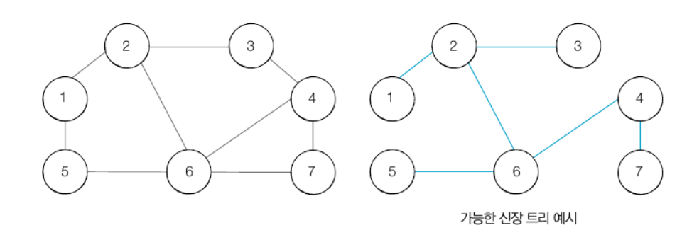
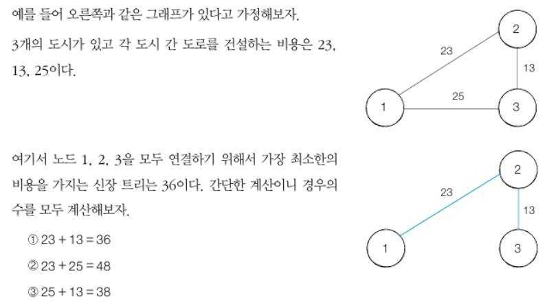

## 그래프 알고리즘 (나동빈 책)

* 크루스칼 알고리즘(Kruskal Algorithm) / 위상 정렬 알고리즘 (Topology Algorithm) 등이 존재

#### 그래프 알고리즘의 예
* 알고리즘 문제를 접했을 때, `서로 다른 개체(혹은 객체) 가 연결되어 있다` -> 그래프 알고리즘

#### 그래프와 트리

| title | 그래프 | 트리 |
| --- | --- | --- | 
| 방향성 | 방향 그래프 혹은 무방향 그래프 | 방향 그래프 |
| 순환성 | 순환 및 비순환  | 비순환 |
| 루트 노드 존재 여부 | 루트 노드가 없음  | 루트 노드가 존재 |
| 노드간 관계성 | 부모와 자식 관계 없음  | 부모와 자식 관계 |
| 모델의 종류 | 네트워크 모델  | 계층 모델 |

 

#### 그래프의 구현 방법
1. 인접 행렬(Adjacency Matrix): 2차원 배열을 사용 -> 플로이드 워셜
2. 인접 리스트(Adjacency List): 리스트를 사용하는 방식 -> 다익스트라 

* 노드의 개수가 V, 간선의 개수가 E인 그래프의 경우

| 특징 | 인접 행렬 | 인접 리스트 | 
| --- | --- | --- | 
| 메모리 공간 | O(V제곱) | O(E) | 
| A에서 B노드로 이어진 간선의 비용| O(1) | O(V) | 

#### 서로소 집합 (Disjoint Sets)
* 서로소 집합 = `공통 원소가 없는 두 집합`
* 서로소 집합 자료구조 = `서로소 부분 집합들로 나누어진 원소들의 데이터를 처리하기 위한 자료구조`
* union(합집합) 과 find(찾기) 연산으로 구성됨

#### 서로소 집합 자료구조

* 트리 자료구조를 이용하여 집합을 표현
* 서로소 집합 알고리즘
    1. union(합집합) 연산을 확인하여, 서로 연결된 두 노드 A,B를 확인한다.
        1. A와 B의 루트 노드 A',B'을 각각 찾는다.
        2. A', B'의 부모 노드로 설정한다 (B'가 A'을 가리키도록(B'->A') 한다.)
    2. 모든 union(합집합) 연산을 처리할 때 까지 1번 과정을 
    
* [disjoint_sets](../graph/disjoint_sets.py)

#### 서로소 집합을 활용한 사이클 판별
* 서로소 집합은 무방향 그래프 내에서의 사이클을 판별할 때 사용 할 수 있다.
* 사이클 여부는 DFS를 이용하여 판별 가능
* union 연산은 그래프에서의 간선으로 표현 -> 간선을 하나씩 확인하면서 두 노드가 포함되어 있는 집합을 합치는 과정을 반복하므로써 사이클 판별이 가능

#### 판별 알고리즘
    1. 각 간선을 확인하며 두 노드의 루트 노드를 확인한다.
        1. 루트 노드가 서로 다르다면 두 노드에 대하여 union 연산을 수행
        2. 루트 노드가 서로 같다면 사이클(Cycle)이 발생한 것
    2. 그래프에 포함되어 있는 모든 간선에 대하여 1번 과정을 반복한다.

* [disjoint_sets_check_cycle](../graph/disjoint_sets_check_cycle.py)

### 신장 트리 (Spanning Tree)
* 하나의 그래프가 있을 때 모든 노드를 포함하면서 사이클이 존재하지 않는 부분 그래프

### 크루스칼 알고리즘 (Kruskal Algorithm)
* `최소한의 비용으로 신장 트리를 찾을 경우`
* 가장 거리가 짧은 간선부터 차례대로 집합에 추가하면 된다
  
#### 예시
* 예를 들어 N개의 도시가 존재하는 상황에서 두 도시 사이에 도로를 놓아 전체 도시가 서로 연결될 수 있게 도로를 설치하는 경우를 생각해보자
* 도시 A에서 도시 B로 이동하는 경로가 반드시 존재하도록 도로를 설치하고자한다. -> 모든 도시를 연결할 때 최소한의 비용으로 연결하려면??
* 

#### 내용
* 신장 트리 중에서 최소 비용으로 만들 수 있는 신장트리를 찾는 알고리즘 = `최소 신장 트리 알고리즘`
* 이 중에서 대표적인 것이 `크루스칼 알고리즘`

#### 판별 알고리즘
1. 간선 데이터를 비용에 따라 오름차순으로 정렬한다.
2. 간선을 하나씩 확인하며 현재의 간선이 사이클을 발생시키는지 확인한다.
   1. 사이클이 발생하지 않는 경우 최소 신장 트리에 포함시킨다.
   2. 사이클이 발생하는 경우 최소 신장 트리에 포함시키지 않는다.
3. 모든 간선에 대하여 2번의 과정을 반복한다.

#### 최소 신장 트리의 특징
* 간선의 개수가 `노드의 개수 - 1` 과 같다

